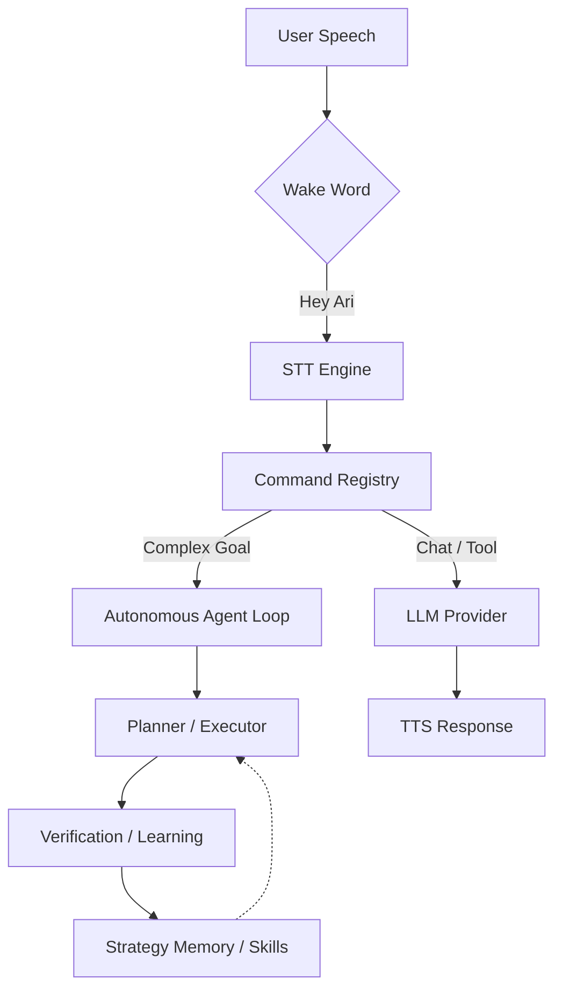

# 🎙️ Ari — Next-Gen AI Voice Assistant

<div align="center">
  
  <p align="center">
    <strong>Multilingual Voice AI Assistant for Windows</strong><br />
    An autonomous execution agent that learns user patterns and evolves.
  </p>

  <p align="center">
    
    
    
    
  </p>

  <p align="center">
    <a href="./README.md">한국어</a> | <a href="./README.ja.md">日本語</a> | <strong>English</strong>
  </p>
</div>

---

## 🌟 Key Philosophy

Ari is more than just a voice recognition program; it is an **Intelligent Autonomous Agent** that understands your work style and automates repetitive tasks.

- **Autonomy:** Simply state your goal, and it will generate/execute Python/Shell code and self-fix errors.
- **Personalization:** Learns your expertise and preferences through dialogue to provide optimized responses.
- **Privacy:** Run LLM and TTS locally without an internet connection using Ollama and CosyVoice3.

---

## 🚀 Key Features

### 1. Intelligent Interaction
- **Full Multilingual Support:** UI, System Prompts, and TTS are optimized for Korean, English, and Japanese.
- **Emotion Engine:** Analyzes emotion tags in AI responses to animate the character in real-time.
- **Hybrid Voice Engine:** Choose between Online (Google) and Offline (faster-whisper) STT as needed.

### 2. Autonomous Execution & Learning
- **Agent Workflow:** Establishes execution plans for complex goals and executes them in parallel via DAG.
- **Skill Library:** Automatically extracts successful patterns and compiles them into Python code for maximum performance.
- **Vision Verification:** Combines OCR and LLM to verify execution results directly on the screen.

### 3. Powerful Extensibility
- **Plugin System:** Provides hooks to dynamically add menus, commands, and LLM tools.
- **Marketplace:** Search and install plugins made by other users directly within the settings window.

---

## 🛠️ Quick Start

### Requirements
- **OS:** Windows 10/11 (64-bit)
- **Python:** 3.11
- **Hardware:** 8GB+ RAM recommended (4GB+ GPU VRAM recommended for local models)

### Installation & Run
```bash
# 1. Clone repository
git clone https://github.com/DO0OG/Ari-VoiceCommand.git
cd Ari-VoiceCommand

# 2. Install dependencies
pip install -r VoiceCommand/requirements.txt

# 3. Run
cd VoiceCommand
py -3.11 Main.py
```

---

## 📈 Performance & Learning Metrics

Ari becomes faster and more accurate over time by leveraging its `SkillLibrary` and `StrategyMemory`.

### Autonomous Success Rate (as of v4.0)
| Task Category | Initial Success | Post-Learning | Key Improvement Factors |
| :--- | :---: | :---: | :--- |
| **File/System Control** | 85% | **98%** | Path auto-correction, Skill compilation |
| **Web Browsing/Search** | 65% | **88%** | DOM analysis optimization, Self-reflection |
| **Complex Workflow** | 40% | **75%** | Parallel DAG execution, Dynamic replanning |

### Self-Learning Progress Guide
> 💡 **Tip:** The agent analyzes the root cause of every failure and records it in the `StrategyMemory`, referencing it during the next attempt to increase the probability of success.

- **0~50 Executions:** Exploration and data collection phase. Replanning may occur frequently.
- **50~200 Executions:** Repetitive tasks begin to be extracted as **Skills**, drastically improving execution speed.
- **200+ Executions:** Most routine commands are executed as optimized Python code, processed instantly without LLM calls.

---

## 🏗️ System Architecture



---

## 📚 Documentation

- 📖 **[Usage Guide](./docs/USAGE.md)**: Detailed settings and usage
- 🔌 **[Plugin Development](./docs/PLUGIN_GUIDE.md)**: Add your own features
- 🎨 **[Theme Customization](./docs/THEME_CUSTOMIZATION.md)**: Change UI design
- 👩‍💻 **[Contributing](./docs/CONTRIBUTING.md)**: Guide for participating in the project

---

## ⚖️ License

Copyright © 2026 [DO0OG (MAD_DOGGO)](https://github.com/DO0OG).
This project is licensed under the **MIT License**.
