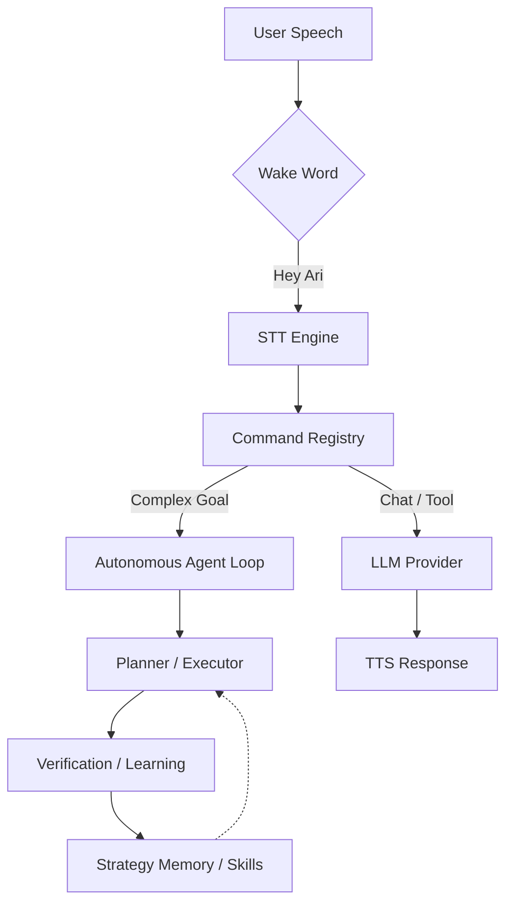

# 🎙️ Ari — AI Voice Assistant

<div align="center">
  
  <p align="center">
    <strong>"Your Personal Autonomous Agent, Just One Word Away"</strong><br />
    A multilingual voice AI assistant that understands, learns, and completes tasks on Windows.
  </p>

  <p align="center">
    
    
    
    
  </p>

  <p align="center">
    <a href="./README.md">한국어</a> | <a href="./README.ja.md">日本語</a> | <strong>English</strong>
  </p>
</div>

---

## ✨ What is Ari?

Ari is not just another voice recognition tool. It is a powerful **Autonomous Agent** that resides on your desktop, capable of **planning and executing complex goals independently.**

### 🤖 Core Features at a Glance

| Feature | Description |
| :--- | :--- |
| **Autonomous Agent** | State your goal, and Ari writes and executes Python/Shell code, with built-in Self-Fixing capabilities. |
| **Adaptive Learning** | Extracts successful patterns into 'Skills'. The more you use it, the faster it runs without LLM calls. |
| **Visual Interaction** | Features a character widget that animates in real-time based on emotions and a sleek chat UI. |
| **Personalized Memory** | Remembers user preferences and expertise from conversations and generates weekly reports. |
| **Local Mode Support** | Run LLM and TTS in a secure environment without an internet connection using Ollama and CosyVoice3. |

---

## 🚀 Key Highlights

- **Natural Dialogue:** Full support for Korean, English, and Japanese with language-optimized system prompts.
- **Powerful Automation:** Browser DOM analysis, file system control, system volume, and power management.
- **Extensible Ecosystem:** Dynamically add new commands and tools via the Plugin System and Marketplace.
- **Intelligent Verification:** Verifies execution results directly on the screen using OCR Vision Verification.

---

## 📈 Performance & Learning Metrics

Ari becomes smarter with every interaction.

### Autonomous Success Rate
| Task Category | Initial Success | Post-Learning |
| :--- | :---: | :---: |
| **File/System Control** | 85% | **98%** |
| **Web Browsing/Search** | 65% | **88%** |
| **Complex Workflow** | 40% | **75%** |

### Self-Learning Progress Guide
- **Step 1 (0-50 runs):** Exploration. Learns from failures and populates `StrategyMemory`.
- **Step 2 (50-200 runs):** Optimization. Frequently used tasks are compiled into **Skills**.
- **Step 3 (200+ runs):** Stability. Routine tasks are processed instantly without LLM intervention.

---

## 🛠️ Quick Start

### Requirements
- **OS:** Windows 10/11 (64-bit)
- **Python:** 3.11
- **Hardware:** 8GB+ RAM (4GB+ GPU VRAM recommended for local models)

### Installation & Run
```bash
# 1. Clone repository
git clone https://github.com/DO0OG/Ari-VoiceCommand.git
cd Ari-VoiceCommand

# 2. Install dependencies
pip install -r VoiceCommand/requirements.txt

# 3. Run
cd VoiceCommand
py -3.11 Main.py
```

---

## 🏗️ System Architecture



---

## 📚 Documentation

- 📖 **[Usage Guide](./docs/USAGE.md)**: Detailed settings and usage
- 🔌 **[Plugin Development](./docs/PLUGIN_GUIDE.md)**: Add your own features
- 🎨 **[Theme Customization](./docs/THEME_CUSTOMIZATION.md)**: Change UI design
- 👩‍💻 **[Contributing](./docs/CONTRIBUTING.md)**: Guide for participating in the project

---

## ⚖️ License

Copyright © 2026 [DO0OG (MAD_DOGGO)](https://github.com/DO0OG).
This project is licensed under the **MIT License**.
