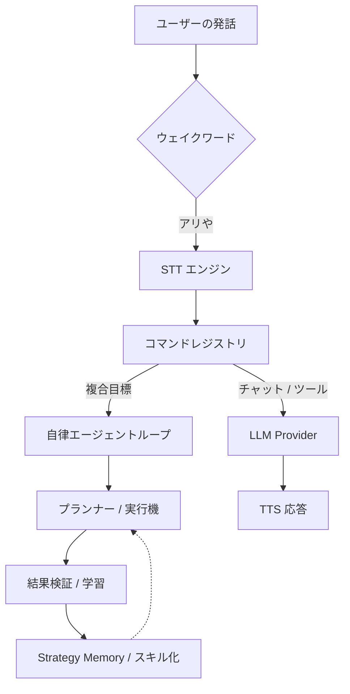

# 🎙️ Ari (アリ) — オープンソース Windows AI 音声アシスタント

<div align="center">
  
  <p align="center">
    <strong>ウェイクワード、多言語 STT/TTS、デスクトップ自動化、MCP ツール、プラグイン、ローカル LLM をサポートする Windows 向け音声アシスタント兼デスクトップエージェントです。</strong><br />
    Ari は Windows デスクトップ上で音声入力を理解し、処理を実行し、その結果を検証しながら継続的に改善される、オープンソースの Python/PySide6 製 AI アシスタントです。
  </p>

  <p align="center">
    
    
    
    
    
    
    
    
  </p>

  <p align="center">
    <a href="./README.ko.md">한국어</a> | <a href="./README.md">English</a> | <strong>日本語</strong>
  </p>
</div>

---

## ✨ 概要

- **Windows ネイティブの AI 音声アシスタント**として、ウェイクワード、音声認識、音声応答機能を提供します。
- **自律エージェントループ**がデスクトップ作業を計画し、ツールやコードを実行し、失敗時には自己修正しながら再試行します。
- **ローカル優先の AI スタック**として、Ollama、CosyVoice3、オフライン寄りの安全な運用を支援します。
- **拡張しやすい構成**で、プラグイン、`SKILL.md` スキル、MCP 連携に対応します。
- **PySide6 デスクトップ UI**により、キャラクターウィジェット、チャット UI、視覚検証フローを提供します。

### クイックリンク

- 📖 [使用ガイド](./docs/USAGE.md)
- 🧩 [Agent Skills / MCP](./docs/USAGE.md#4-에이전트-스킬-skills--mcp)
- 🔌 [プラグイン開発](./docs/PLUGIN_GUIDE.md)
- 🌐 [プロジェクトホームページ](https://ari-voice-command.vercel.app)
- 👩‍💻 [コントリビュート](./docs/CONTRIBUTING.md)

---

## 🛠️ クイックスタート

### 要件

- **OS:** Windows 10/11 (64-bit)
- **Python:** 3.11
- **Hardware:** RAM 8GB 以上推奨（ローカルモデル利用時は GPU VRAM 4GB 以上推奨）

### インストールと実行

```bash
# 1. リポジトリをクローン
git clone https://github.com/DO0OG/Ari-VoiceCommand.git
cd Ari-VoiceCommand

# 2. 依存関係のインストール
pip install -r VoiceCommand/requirements.txt

# 3. 実行
cd VoiceCommand
py -3.11 Main.py
```

---

## 🤖 Ari とは？

Ari は、聞く、計画する、実行する、検証する、学習するといった流れを持つ **Windows AI 音声アシスタント**兼 **自律デスクトップエージェント**です。

### 主要機能

| 領域 | 内容 |
| :--- | :--- |
| **音声パイプライン** | ウェイクワード、多言語 STT、自然な TTS 応答をサポートします。 |
| **エージェント / 自動化** | 複雑な目標を計画し、Python/Shell 自動化を実行し、自己修正を行いながら再試行します。 |
| **スキル / プラグイン / MCP** | `SKILL.md` パッケージ、プラグイン、ローカル/リモート MCP ツールで機能を拡張できます。 |
| **ローカル AI スタック** | Ollama やローカル TTS パイプラインを活用し、プライバシー重視の環境に対応します。 |
| **UI / 検証** | PySide6 UI、アニメーションキャラクター、テキストチャット、OCR ベースの結果検証を提供します。 |
| **記憶 / パーソナライズ** | ユーザー設定や実行戦略を蓄積し、繰り返し作業を最適化します。 |

---

## 🚀 開発者向けハイライト

- **Python + PySide6 デスクトップアプリ:** Windows 向けに把握しやすく、拡張しやすい構成です。
- **自動化中心設計:** ブラウザ DOM 制御、ファイル / システム操作、エージェント駆動ワークフローを扱えます。
- **広い統合面:** OpenAI 互換プロバイダ、Ollama、MCP サーバー、プラグイン、インストール型スキルと柔軟に連携できます。
- **学習指向ランタイム:** Strategy Memory、同一実行内の失敗反省リトライ、埋め込みベースのスキル照合、スキルコンパイルにより反復作業の実行品質を高めます。

### 最近の自己改善ループ更新

- **同一実行内の即時復旧:** 失敗した実行は reflection lesson を同じ orchestration セッション内の 1 回限りの再試行コンテキストへ直接注入できます。
- **バックグラウンド reflection 経路:** 成功した実行では reflection を非同期で予約し、ユーザー向け完了応答を不要に遅らせません。
- **shared context キャッシュ:** Episode Memory や Goal Predictor の高コスト検索を実行ごとに 1 回だけ収集し、reflection 再試行でも再利用します。
- **計画反復回数の動的化:** 固定回数ではなく目標難易度を推定して再計画の最大回数を調整します。
- **反復失敗の早期終了:** 同じ再計画理由や同じ段階エラーシグネチャが続く場合は、無駄なループを早めに打ち切ります。
- **回復戦略の多様化:** 実行回復は必要に応じて LLM 修正だけでなく、単純化や optional ステップのスキップまで広げます。
- **lift ベースの有効化ゲート:** 学習指標で効果が負になったコンポーネントは一時的に無効化できます。
- **再利用スキル照合の改善:** スキル検索は trigger/tag ヒューリスティックに加えて埋め込み類似度も使うため、言い換えた目標でも見つけやすくなりました。
- **週間学習可視化:** 週間レポートに学習コンポーネントの活動、新規スキル数、Python コンパイル数、自己改善推定トークンを表示します。
- **i18n 保守の一貫性:** 自己改善ループ関連の新規文字列を韓国語・英語・日本語 locale にそろえて反映します。

---

## 🏗️ システムアーキテクチャ

Ari はウェイクワードを起点に要求をコマンド層とエージェント層へ振り分け、ツールまたは LLM ワークフローを実行した後、その結果を検証し、学習へ反映します。



---

## 📈 性能と学習

Ari は使うほど改善される設計です。

| タスクカテゴリ | 初期成功率 | 学習後成功率 |
| :--- | :---: | :---: |
| **ファイル / システム制御** | 85% | **98%** |
| **ウェブ閲覧 / 検索** | 65% | **88%** |
| **複合ワークフロー** | 40% | **75%** |

- **Step 1 (0-50回):** 探索と `StrategyMemory` の蓄積
- **Step 2 (50-200回):** 最適化とスキルコンパイル
- **Step 3 (200回以上):** LLM 依存を抑えた高速な定型反復処理

---

## 📚 ドキュメント

- 📖 **[使用ガイド](./docs/USAGE.md)**: セットアップ、操作、設定
- 🧩 **[Agent Skills / MCP](./docs/USAGE.md#4-에이전트-스킬-skills--mcp)**: スキル導入、管理 UI、MCP フロー
- 🔌 **[プラグイン開発](./docs/PLUGIN_GUIDE.md)**: 独自機能の追加
- 🎨 **[テーマカスタマイズ](./docs/THEME_CUSTOMIZATION.md)**: UI と見た目の変更

---

## 🤝 コントリビュート

Windows 自動化、STT/TTS 連携、ローカルモデル対応、PySide6 UX、プラグイン基盤、MCP ワークフローまわりの貢献を歓迎します。

詳細は [コントリビューションガイド](./docs/CONTRIBUTING.md) をご覧ください。

---

## 🎨 アセットと出典

- `DNFBitBitv2` フォント — 公式配布元:
  <https://df.nexon.com/data/font/dnfbitbitv2>

本プロジェクト外で再配布または再利用する場合は、当該フォントの利用条件もあわせて確認してください。

---

## ⚖️ License

Copyright © 2026 [DO0OG (MAD_DOGGO)](https://github.com/DO0OG).
This project is licensed under the **MIT License**.
