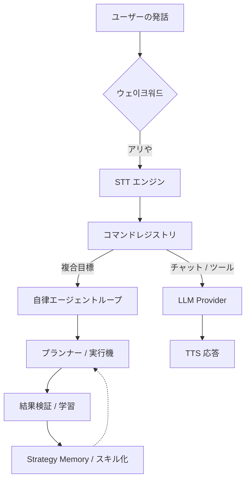

# 🎙️ Ari (アリ) — 次世代 AI 音声アシスタント

<div align="center">
  
  <p align="center">
    <strong>Windows 専用 多言語対応音声 AI アシスタント</strong><br />
    ユーザーのパターンを学習し、自ら進化する自律実行エージェント。
  </p>

  <p align="center">
    
    
    
    
  </p>

  <p align="center">
    <a href="./README.md">한국어</a> | <a href="./README.en.md">English</a> | <strong>日本語</strong>
  </p>
</div>

---

## 🌟 核心理念

Ari は単なる音声認識プログラムを超え、ユーザーの作業スタイルを理解し、繰り返される業務を自ら自動化する**知能型自律エージェント**を目指しています。

- **自律性:** 目標を伝えるだけで Python/Shell コードを直接生成・実行し、エラーを自ら修正します。
- **パーソナライズ:** 対話を通じてユーザーの専門 분야や好みを学習し、最適化された応答を提供します。
- **プライバシー:** Ollama と CosyVoice3 を使用することで、インターネット接続なしでローカル環境で LLM と TTS を稼働させることができます。

---

## 🚀 主な機能

### 1. 知能型インタラクション
- **多言語完全サポート:** UI、システムプロンプト、TTS 音声が韓国語・英語・日本語に最適化されています。
- **感情エンジン:** AI の応答に含まれる感情タグを分析し、キャラクターがリアルタイムでアニメーションします。
- **ハイブリッド音声エンジン:** オンライン (Google) とオフライン (faster-whisper) の STT を状況に合わせて選択可能です。

### 2. 自律実行と学習
- **エージェントワークフロー:** 複雑な目標に対して実行計画を策定し、DAG に基づいて並列実行します。
- **スキルライブラリ:** 成功した作業パターンを自動的に抽出し、Python コードにコンパイルしてパフォーマンスを最大化します。
- **ビジョン検証:** OCR と LLM を組み合わせて、実行結果を画面上で直接検証します。

### 3. 強力な拡張性
- **プラグインシステム:** メニュー、コマンド、LLM ツールを動的に追加できるプラグインフックを提供します。
- **マーケットプレイス:** 設定画面内で他のユーザーが作成したプラグインを検索し、即座にインストールできます。

---

## 📈 性能および学習指標

Ari は、利用回数が増えるにつれて `SkillLibrary` と `StrategyMemory` を通じてより高速かつ正確になります。

### 自律実行成功率 (v4.0 基準)
| タスクタイプ | 初期成功率 | 学習後成功率 | 主な改善要素 |
| :--- | :---: | :---: | :--- |
| **ファイル/システム制御** | 85% | **98%** | パス自動補正、スキルコンパイル |
| **ウェブ閲覧/検索** | 65% | **88%** | DOM解析最適化、失敗の反省 |
| **複合ワークフロー** | 40% | **75%** | DAG並列実行、動적再計画 |

### 自己学習ステップガイド
> 💡 **Tip:** 繰り返される失敗はエージェントが自ら原因を分析して `StrategyMemory` に記録し、次回の試行時にこれを参照して成功確率を高めます。

- **0〜50回の実行:** 探索およびデータ収集フェーズ。同じアプリ内でも再計画が発生することがあります。
- **50〜200回の実行:** 繰り返し作業が **スキル(Skill)** として抽出され始め、実行速度が飛躍的に向上します。
- **200回以上:** ほとんどの日常的なコマンドが最適化された Python コードで実行され、LLM を呼び出すことなく即座に処理されます。

---

## 🛠️ クイックスタート

### 要求仕様
- **OS:** Windows 10/11 (64-bit)
- **Python:** 3.11
- **Hardware:** RAM 8GB 以上推奨 (ローカルモデル稼働時は GPU VRAM 4GB 以上推奨)

### インストールと実行
```bash
# 1. リポジトリをクローン
git clone https://github.com/DO0OG/Ari-VoiceCommand.git
cd Ari-VoiceCommand

# 2. 依存関係のインストール
pip install -r VoiceCommand/requirements.txt

# 3. 実行
cd VoiceCommand
py -3.11 Main.py
```

---

## 🏗️ システムアーキテクチャ



---

## 📚 ドキュメント

- 📖 **[プログラム使用ガイド](./docs/USAGE.md)**: 詳細設定と使い方
- 🔌 **[プラグイン制作](./docs/PLUGIN_GUIDE.md)**: 自分だけの機能を追加する
- 🎨 **[テーマカスタマイズ](./docs/THEME_CUSTOMIZATION.md)**: UI デザインの変更
- 👩‍💻 **[貢献する](./docs/CONTRIBUTING.md)**: プロジェクト参加ガイド

---

## ⚖️ License

Copyright © 2026 [DO0OG (MAD_DOGGO)](https://github.com/DO0OG).
This project is licensed under the **MIT License**.
