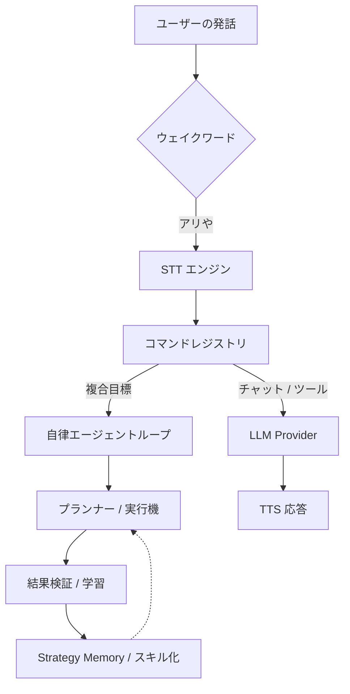

# 🎙️ Ari (アリ) — AI Voice Assistant

<div align="center">
  
  <p align="center">
    <strong>「言葉一つで始まる、あなただけの自律エージェント」</strong><br />
    Windows 環境を理解し、学習し、自ら業務を完遂する多言語対応音声 AI アシスタントです。
  </p>

  <p align="center">
    
    
    
    
  </p>

  <p align="center">
    <a href="./README.md">한국어</a> | <a href="./README.en.md">English</a> | <strong>日本語</strong>
  </p>
</div>

---

## ✨ Ari (アリ) とは？

Ari は単なる音声認識ツールではありません。デスクトップに常駐し、**複雑な目標を自ら計画・実行**する強力な **自律エージェント (Autonomous Agent)** です。

### 🤖 主要機能の一覧

| 機能 | 説明 |
| :--- | :--- |
| **自律実行 (Agent)** | 目標を伝えるだけで Python/Shell コードを生成・実行。エラー時には自ら修正 (Self-Fix) します。 |
| **自己学習 (Learning)** | 成功したパターンを「スキル」として保存。繰り返すほど LLM を呼び出さずに高速に動作します。 |
| **視覚的インタラクション** | 感情に合わせてリアルタイムにアニメーションするキャラクターウィジェットとチャット UI を提供します。 |
| **パーソナライズ記憶** | 対話を通じて好みや専門分野を記憶。カスタマイズされた週次レポートを生成します。 |
| **ローカルモード対応** | Ollama と CosyVoice3 により、オフラインの安全な環境で LLM と TTS を稼働できます。 |

---

## 🚀 主要なハイライト

- **自然な対話:** 韓国語・英語・日本語を完全サポート。言語ごとに最適化されたプロンプトを注入。
- **強力な自動化:** ブラウザ DOM 解析、ファイルシステム制御、システム音量および電源管理。
- **拡張可能なエコシステム:** プラグインシステムにより、新しいコマンドやツールを即座に追加・共有。
- **知能型結果検証:** 実行結果を OCR ビジョン検証により、画面上で直接確認。

---

## 📈 性能および学習指標

使えば使うほど、Ari は賢くなります。

### 自律実行成功率
| タスクタイプ | 初期成功率 | 学習後成功率 | 主な改善要素 |
| :--- | :---: | :---: | :--- |
| **ファイル/システム制御** | 85% | **98%** | パス自動補正、スキルコンパイル |
| **ウェブ閲覧/検索** | 65% | **88%** | DOM 解析最適化、自己反省 |
| **複合ワークフロー** | 40% | **75%** | 並列実行、動的再計画 |

### 自己学習ステップガイド
- **Step 1 (0-50回):** 探索フェーズ。失敗から学び `StrategyMemory` を蓄積。
- **Step 2 (50-200回):** 最適化フェーズ。よく使う作業が **スキル (Skill)** としてコンパイル。
- **Step 3 (200回+):** 安定フェーズ。日常業務の多くを LLM なしで即座に処理。

---

## 🛠️ クイックスタート

### 要求仕様
- **OS:** Windows 10/11 (64-bit)
- **Python:** 3.11
- **Hardware:** RAM 8GB 以上推奨 (ローカルモデル稼働時は GPU VRAM 4GB 以上推奨)

### インストールと実行
```bash
# 1. リポジトリをクローン
git clone https://github.com/DO0OG/Ari-VoiceCommand.git
cd Ari-VoiceCommand

# 2. 依存関係のインストール
pip install -r VoiceCommand/requirements.txt

# 3. 実行
cd VoiceCommand
py -3.11 Main.py
```

---

## 🏗️ システムアーキテクチャ



---

## 📚 ドキュメント

- 📖 **[プログラム使用ガイド](./docs/USAGE.md)**: 詳細設定と使い方
- 🔌 **[プラグイン制作](./docs/PLUGIN_GUIDE.md)**: 自分だけの機能を追加する
- 🎨 **[テーマカスタマイズ](./docs/THEME_CUSTOMIZATION.md)**: UI デザインの変更
- 👩‍💻 **[貢献する](./docs/CONTRIBUTING.md)**: プロジェクト参加ガイド

---

## ⚖️ License

Copyright © 2026 [DO0OG (MAD_DOGGO)](https://github.com/DO0OG).
This project is licensed under the **MIT License**.
