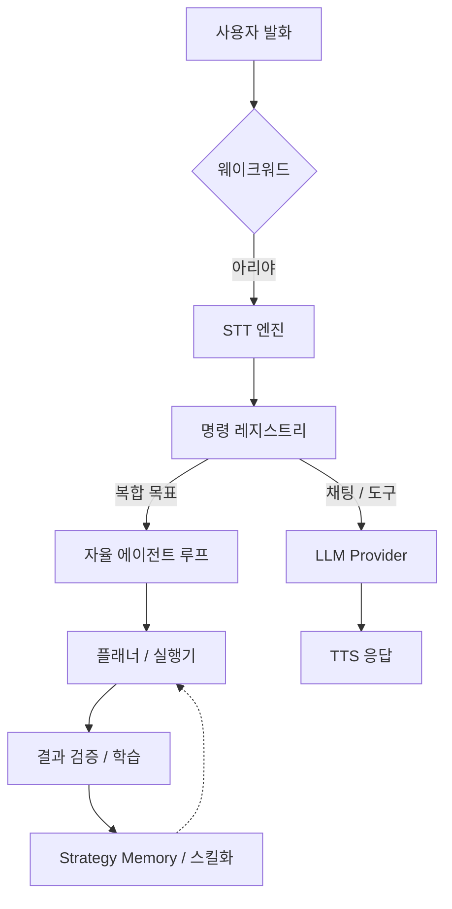

# 🎙️ Ari (아리) — 오픈소스 Windows AI 음성 어시스턴트

<div align="center">
  
  <p align="center">
    <strong>웨이크워드, 다국어 STT/TTS, 데스크톱 자동화, MCP 도구, 플러그인, 로컬 LLM을 지원하는 Windows용 음성 어시스턴트이자 데스크톱 에이전트입니다.</strong><br />
    Ari는 Windows 데스크톱에서 음성 입력을 이해하고, 작업을 실행하며, 결과를 검증하고, 사용하면서 점차 개선되는 오픈소스 Python/PySide6 기반 AI 어시스턴트입니다.
  </p>

  <p align="center">
    
    
    
    
    
    
    
    
  </p>

  <p align="center">
    <strong>한국어</strong> | <a href="./README.md">English</a> | <a href="./README.ja.md">日本語</a>
  </p>
</div>

---

## ✨ 한눈에 보기

- **Windows 네이티브 AI 음성 어시스턴트**로서 웨이크워드, 음성 인식, 음성 응답 기능을 제공합니다.
- **자율 에이전트 루프**가 데스크톱 작업을 계획하고, 도구나 코드를 실행하며, 실패 시 자기 보정과 함께 재시도합니다.
- **로컬 우선 AI 스택**으로 Ollama, CosyVoice3, 오프라인 친화적 워크플로를 지원합니다.
- **확장 가능한 구조**로 플러그인, `SKILL.md` 스킬, Model Context Protocol(MCP) 연동을 지원합니다.
- **PySide6 데스크톱 UI**를 통해 캐릭터 위젯, 채팅 UI, 시각 검증 흐름을 제공합니다.

### 빠른 링크

- 📖 [사용 가이드](./docs/USAGE.md)
- 🧩 [에이전트 스킬 / MCP](./docs/USAGE.md#4-에이전트-스킬-skills--mcp)
- 🔌 [플러그인 개발](./docs/PLUGIN_GUIDE.md)
- 🌐 [프로젝트 홈페이지](https://ari-voice-command.vercel.app)
- 👩‍💻 [기여 가이드](./docs/CONTRIBUTING.md)

---

## 🛠️ 빠른 시작

### 요구 사항

- **OS:** Windows 10/11 (64-bit)
- **Python:** 3.11
- **Hardware:** RAM 8GB 이상 권장 (로컬 모델 사용 시 GPU VRAM 4GB 이상 권장)

### 설치 및 실행

```bash
# 1. 저장소 클론
git clone https://github.com/DO0OG/Ari-VoiceCommand.git
cd Ari-VoiceCommand

# 2. 의존성 설치
pip install -r VoiceCommand/requirements.txt

# 3. 실행
cd VoiceCommand
py -3.11 Main.py
```

---

## 🤖 Ari는 어떤 프로젝트인가요?

Ari는 듣고, 계획하고, 실행하고, 검증하고, 학습하는 흐름을 갖춘 **Windows AI 음성 어시스턴트**이자 **자율 데스크톱 에이전트**입니다.

### 핵심 기능

| 영역 | 설명 |
| :--- | :--- |
| **음성 파이프라인** | 웨이크워드 활성화, 다국어 STT, 자연스러운 TTS 응답을 지원합니다. |
| **에이전트 / 자동화** | 복합 목표를 계획하고 Python/Shell 자동화를 실행하며, 자기 수정 전략을 통해 재시도합니다. |
| **스킬 / 플러그인 / MCP** | `SKILL.md` 패키지, 플러그인, 로컬/원격 MCP 도구로 기능을 확장할 수 있습니다. |
| **로컬 AI 스택** | Ollama와 로컬 TTS 파이프라인을 통해 프라이버시 민감 환경도 지원합니다. |
| **UI / 검증** | PySide6 UI, 애니메이션 캐릭터, 텍스트 채팅, OCR 기반 결과 검증을 제공합니다. |
| **기억 / 개인화** | 사용자 선호와 실행 전략을 축적해 반복 작업을 최적화합니다. |

### 캐릭터 위젯 주요 확장 기능

- **친밀도 시스템:** 클릭, 쓰다듬기, 대화, 일일 첫 실행을 누적해 호칭과 반응을 바꿉니다.
- **머리 위 고정 오버레이 UI:** 친밀도/시스템 모니터 오버레이가 캐릭터 머리 위에 표시되고, 멀티모니터 이동 중에도 캐릭터를 따라다닙니다.
- **쓰다듬기 반응:** 캐릭터 위에 마우스를 천천히 올려두면 만족 반응과 친밀도 상승이 발생합니다.
- **포커스 앱 반응:** 코딩, 브라우저, 영상, 메신저, 오피스, 게임 등 포그라운드 앱 유형에 따라 반응합니다.
- **야간 졸린 모드:** 밤 시간대에는 애니메이션 속도를 늦추고 하품/졸림 반응을 보여줍니다.
- **시스템 모니터 경고:** CPU/RAM 과부하와 배터리 부족 상태에 맞춰 쿨다운 기반 경고를 표시합니다.
- **말풍선 히스토리/커스텀 메시지:** 최근 말풍선 기록을 확인하고 idle 메시지를 직접 등록할 수 있습니다.

---

## 🚀 개발자 관점 하이라이트

- **Python + PySide6 데스크톱 앱:** Windows 애플리케이션 구조를 파악하고 확장하고 패키징하기 쉬운 구성을 갖추고 있습니다.
- **자동화 중심 설계:** 브라우저 DOM 제어, 파일/시스템 작업, 에이전트 기반 워크플로 실행을 지원합니다.
- **넓은 통합 표면:** OpenAI 호환 제공자, Ollama, MCP 서버, 플러그인, 설치형 스킬과 유연하게 연동할 수 있습니다.
- **학습 지향 런타임:** Strategy Memory, 동일 실행 내 실패 반성 재시도, 임베딩 기반 스킬 매칭, 스킬 컴파일로 반복 작업 수행 품질을 높입니다.

### 최근 자기개선 루프 업데이트

- **동일 실행 내 즉시 복구:** 실패한 실행은 reflection lesson을 같은 orchestration 세션의 1회 재시도 컨텍스트에 바로 주입할 수 있습니다.
- **백그라운드 reflection 경로:** 성공한 실행은 reflection을 비동기로 예약해 사용자 응답 완료를 불필요하게 지연시키지 않습니다.
- **shared context 캐싱:** Episode Memory와 Goal Predictor 같은 고비용 조회를 실행당 1회만 수집하고 reflection 재시도에도 재사용합니다.
- **계획 반복 횟수 동적화:** 고정 루프 횟수 대신 목표 난이도를 추정해 재계획 최대 횟수를 조절합니다.
- **반복 실패 조기 종료:** 동일 재계획 이유나 동일 단계 오류 시그니처가 반복되면 불필요한 루프를 더 빨리 중단합니다.
- **회복 전략 다변화:** 실행 복구는 필요 시 LLM 수정에서 단계 단순화, optional 단계 스킵까지 확장됩니다.
- **lift 기반 활성화 게이팅:** 학습 지표에서 효과가 음수로 확인된 컴포넌트는 일시적으로 비활성화할 수 있습니다.
- **재사용 스킬 매칭 개선:** 스킬 조회가 trigger/tag 휴리스틱에 더해 임베딩 유사도까지 반영해 유사 표현을 더 잘 찾습니다.
- **주간 학습 가시성 강화:** 주간 보고서에 학습 컴포넌트 활성화 현황, 신규 스킬 수, Python 컴파일 수, 자기개선 추정 토큰이 함께 표시됩니다.
- **i18n 유지보수 일관성:** 자기개선 루프 관련 신규 문자열을 한국어/영어/일본어 locale에 함께 반영합니다.

---

## 🏗️ 시스템 아키텍처

Ari는 웨이크워드를 시작점으로 요청을 명령 계층과 에이전트 계층으로 라우팅하고, 도구 또는 LLM 워크플로를 실행한 뒤 그 결과를 검증하고 학습합니다.



---

## 📈 성능과 학습

Ari는 사용할수록 개선되도록 설계되었습니다.

| 작업 범주 | 초기 성공률 | 학습 후 성공률 |
| :--- | :---: | :---: |
| **파일 / 시스템 제어** | 85% | **98%** |
| **웹 탐색 / 검색** | 65% | **88%** |
| **복합 워크플로** | 40% | **75%** |

- **Step 1 (0-50회):** 탐색과 `StrategyMemory` 축적
- **Step 2 (50-200회):** 최적화와 스킬 컴파일
- **Step 3 (200회 이상):** LLM 의존도를 낮춘 고속 반복 작업 처리

---

## 📚 문서

- 📖 **[사용 가이드](./docs/USAGE.md)**: 설정, 사용법, 운영 방법
- 🧩 **[에이전트 스킬 / MCP](./docs/USAGE.md#4-에이전트-스킬-skills--mcp)**: 스킬 설치, 관리 UI, MCP 흐름
- 🔌 **[플러그인 개발](./docs/PLUGIN_GUIDE.md)**: 기능 확장 방법
- 🎨 **[테마 커스터마이징](./docs/THEME_CUSTOMIZATION.md)**: UI와 외형 변경

---

## 🤝 기여

Windows 자동화, STT/TTS 연동, 로컬 모델 지원, PySide6 UX, 플러그인 도구화, MCP 워크플로 관련 기여를 환영합니다.

자세한 내용은 [기여 가이드](./docs/CONTRIBUTING.md)를 참고해 주세요.

---

## 🎨 에셋 및 출처

- `DNFBitBitv2` 폰트 — 공식 출처:
  <https://df.nexon.com/data/font/dnfbitbitv2>

프로젝트 외부로 재배포하거나 재사용할 때는 해당 폰트의 이용 조건을 함께 확인해 주세요.

---

## ⚖️ License

Copyright © 2026 [DO0OG (MAD_DOGGO)](https://github.com/DO0OG).
This project is licensed under the **MIT License**.
