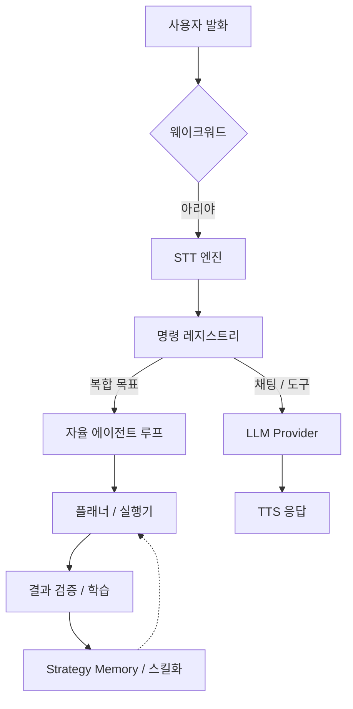

# 🎙️ Ari (아리) — AI Voice Assistant

<div align="center">
  
  <p align="center">
    <strong>"말 한마디로 시작하는 당신만의 자율 에이전트"</strong><br />
    Windows 환경을 이해하고, 학습하며, 스스로 업무를 완수하는 다국어 음성 AI 어시스턴트입니다.
  </p>

  <p align="center">
    
    
    
    
  </p>

  <p align="center">
    <a href="./README.en.md">English</a> | <a href="./README.ja.md">日本語</a> | <strong>한국어</strong>
  </p>
</div>

---

## ✨ 아리는 어떤 프로젝트인가요?

아리는 단순한 음성 인식 도구가 아닙니다. 사용자의 데스크탑 위에 상주하며 **복합적인 목표를 스스로 계획하고 실행**하는 강력한 **자율 에이전트(Autonomous Agent)**입니다. 

### 🤖 핵심 기능 한눈에 보기

| 기능 | 설명 |
| :--- | :--- |
| **자율 실행 (Agent)** | 목표를 말하면 Python/Shell 코드를 직접 짜서 실행하고, 오류 발생 시 스스로 수정(Self-Fix)합니다. |
| **자가 학습 (Learning)** | 성공한 작업 패턴을 추출하여 '스킬'로 저장하며, 반복될수록 LLM 호출 없이 더 빠르게 실행됩니다. |
| **시각적 상호작용** | 감정에 따라 실시간으로 애니메이션되는 캐릭터 위젯과 텍스트 채팅 UI를 제공합니다. |
| **개인화 기억** | 사용자와의 대화를 통해 선호도와 전문 분야를 기억하고, 맞춤형 주간 리포트를 생성합니다. |
| **로컬 모드 지원** | Ollama와 CosyVoice3를 통해 인터넷 연결 없는 보안 환경에서도 LLM과 TTS를 구동할 수 있습니다. |

---

## 🚀 주요 하이라이트

- **자연스러운 대화:** 한국어·영어·일본어 완벽 지원 및 언어별 최적화된 시스템 프롬프트 주입.
- **강력한 자동화:** 브라우저 DOM 분석, 파일 시스템 제어, 시스템 볼륨 및 전원 관리.
- **확장 가능한 생태계:** 플러그인 시스템을 통해 새로운 명령과 도구를 즉시 추가하고 마켓플레이스에서 공유.
- **지능형 결과 검증:** 실행 결과를 단순 텍스트가 아닌 OCR 비전 검증을 통해 화면상에서 직접 확인.

---

## 📈 성능 및 학습 지표

사용하면 할수록 아리는 더 똑똑해집니다.

### 자율실행 성공률
| 작업 유형 | 초기 성공률 | 학습 후 성공률 |
| :--- | :---: | :---: |
| **파일/시스템 제어** | 85% | **98%** |
| **웹 브라우징/검색** | 65% | **88%** |
| **복합 워크플로우** | 40% | **75%** |

### 자가학습 단계별 가이드
- **Step 1 (0~50회):** 탐색 단계. 실패를 통해 `StrategyMemory`를 축적합니다.
- **Step 2 (50~200회):** 최적화 단계. 자주 쓰는 작업이 **스킬(Skill)**로 컴파일됩니다.
- **Step 3 (200회+):** 안정 단계. 대부분의 일상 업무를 LLM 도움 없이 즉각 처리합니다.

---

## 🛠️ 빠른 시작

### 요구 사양
- **OS:** Windows 10/11 (64-bit)
- **Python:** 3.11
- **Hardware:** RAM 8GB 이상 권장 (로컬 모델 구동 시 GPU VRAM 4GB 이상 권장)

### 설치 및 실행
```bash
# 1. 저장소 클론
git clone https://github.com/DO0OG/Ari-VoiceCommand.git
cd Ari-VoiceCommand

# 2. 의존성 설치
pip install -r VoiceCommand/requirements.txt

# 3. 실행
cd VoiceCommand
py -3.11 Main.py
```

---

## 🏗️ 시스템 아키텍처



---

## 📚 문서 및 링크

- 📖 **[사용자 가이드](./docs/USAGE.md)**: 상세 설정 및 사용법
- 🔌 **[플러그인 제작](./docs/PLUGIN_GUIDE.md)**: 나만의 기능 추가하기
- 🎨 **[테마 커스터마이징](./docs/THEME_CUSTOMIZATION.md)**: UI 디자인 변경
- 👩‍💻 **[기여하기](./docs/CONTRIBUTING.md)**: 프로젝트 참여 가이드

---

## ⚖️ License

Copyright © 2026 [DO0OG (MAD_DOGGO)](https://github.com/DO0OG).
This project is licensed under the **MIT License**.
