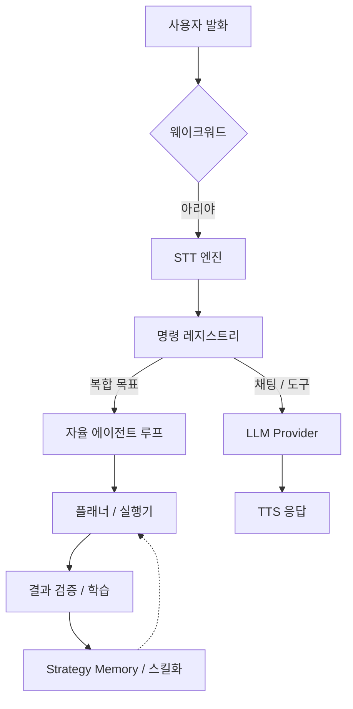

# 🎙️ Ari (아리) — Next-Gen AI Voice Assistant

<div align="center">
  
  <p align="center">
    <strong>Windows 전용 다국어 음성 AI 어시스턴트</strong><br />
    사용자의 패턴을 학습하고 스스로 진화하는 자율 실행 에이전트.
  </p>

  <p align="center">
    
    
    
    
  </p>

  <p align="center">
    <a href="./README.en.md">English</a> | <a href="./README.ja.md">日本語</a> | <strong>한국어</strong>
  </p>
</div>

---

## 🌟 Key Philosophy

아리(Ari)는 단순한 음성 인식 프로그램을 넘어, 사용자의 작업 스타일을 이해하고 반복되는 업무를 스스로 자동화하는 **지능형 자율 에이전트**를 지향합니다. 

- **자율성:** 목표만 말하면 Python/Shell 코드를 직접 생성하고 실행하며 오류를 스스로 수정합니다.
- **개인화:** 대화를 통해 사용자의 전문 분야와 선호도를 학습하여 최적화된 응답을 제공합니다.
- **프라이버시:** Ollama와 CosyVoice3를 통해 인터넷 연결 없이 로컬 환경에서 LLM과 TTS를 구동할 수 있습니다.

---

## 🚀 주요 기능

### 1. 지능형 인터랙션
- **다국어 완벽 지원:** UI, 시스템 프롬프트, TTS 음성이 한국어/영어/일본어에 최적화되어 있습니다.
- **감정 엔진:** AI 응답의 감정 태그를 분석하여 캐릭터가 실시간으로 애니메이션됩니다.
- **하이브리드 음성 엔진:** 온라인(Google)과 오프라인(faster-whisper) STT를 상황에 맞게 선택 가능합니다.

### 2. 자율 실행 및 학습
- **에이전트 워크플로우:** 복합 목표에 대해 실행 계획을 수립하고 DAG 기반으로 병렬 실행합니다.
- **스킬 라이브러리:** 성공한 작업 패턴을 자동으로 추출하여 Python 코드로 컴파일, 성능을 극대화합니다.
- **비전 검증:** OCR과 LLM을 결합하여 실행 결과를 화면상에서 직접 검증합니다.

### 3. 강력한 확장성
- **플러그인 시스템:** 메뉴, 명령, LLM 도구를 동적으로 추가할 수 있는 플러그인 훅을 제공합니다.
- **마켓플레이스:** 설정창 내에서 다른 사용자가 만든 플러그인을 검색하고 즉시 설치할 수 있습니다.

---

## 🛠️ 빠른 시작

### 요구 사양
- **OS:** Windows 10/11 (64-bit)
- **Python:** 3.11
- **Hardware:** RAM 8GB 이상 권장 (로컬 모델 구동 시 GPU VRAM 4GB 이상 권장)

### 설치 및 실행
```bash
# 1. 저장소 클론
git clone https://github.com/DO0OG/Ari-VoiceCommand.git
cd Ari-VoiceCommand

# 2. 의존성 설치
pip install -r VoiceCommand/requirements.txt

# 3. 실행
cd VoiceCommand
py -3.11 Main.py
```

---

## 📈 성능 및 학습 지표

아리는 사용자의 이용 횟수가 늘어날수록 `SkillLibrary`와 `StrategyMemory`를 통해 더 빠르고 정확해집니다.

### 자율실행 성공률 (v4.0 기준)
| 작업 유형 | 초기 성공률 | 학습 후 성공률 | 주요 개선 요소 |
| :--- | :---: | :---: | :--- |
| **파일/시스템 제어** | 85% | **98%** | 경로 자동 보정, 스킬 컴파일 |
| **웹 브라우징/검색** | 65% | **88%** | DOM 분석 최적화, 실패 반성 |
| **복합 워크플로우** | 40% | **75%** | DAG 병렬 실행, 동적 재계획 |

### 자가학습 단계별 가이드
> 💡 **Tip:** 반복되는 실패는 에이전트가 스스로 원인을 분석하여 `StrategyMemory`에 기록하며, 다음 시도 시 이를 참고해 성공 확률을 높입니다.

- **0~50회 실행:** 탐색 및 데이터 수집 단계. 동일 앱에서도 재계획이 발생할 수 있습니다.
- **50~200회 실행:** 반복 작업이 **스킬(Skill)**로 추출되기 시작하며, 실행 속도가 비약적으로 향상됩니다.
- **200회 이상:** 대부분의 일상적인 명령이 최적화된 Python 코드로 실행되어 LLM 호출 없이 즉시 처리됩니다.

---

## 🏗️ 시스템 아키텍처



---

## 📚 문서 및 링크

- 📖 **[사용자 가이드](./docs/USAGE.md)**: 상세 설정 및 사용법
- 🔌 **[플러그인 제작](./docs/PLUGIN_GUIDE.md)**: 나만의 기능 추가하기
- 🎨 **[테마 커스터마이징](./docs/THEME_CUSTOMIZATION.md)**: UI 디자인 변경
- 👩‍💻 **[기여하기](./docs/CONTRIBUTING.md)**: 프로젝트 참여 가이드

---

## ⚖️ License

Copyright © 2026 [DO0OG (MAD_DOGGO)](https://github.com/DO0OG).
This project is licensed under the **MIT License**.
