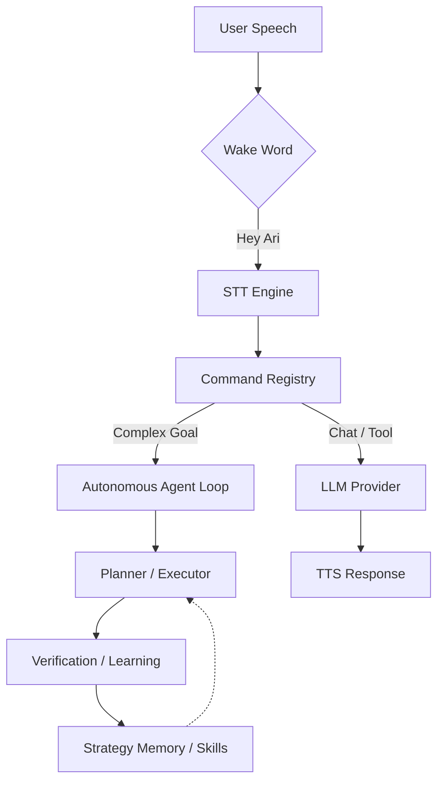

# 🎙️ Ari — Open-Source Windows AI Voice Assistant

<div align="center">
  
  <p align="center">
    <strong>A Windows voice assistant and desktop agent with wake word, multilingual STT/TTS, desktop automation, MCP tools, plugins, and local LLM support.</strong><br />
    Ari is an open-source Python/PySide6 desktop assistant for Windows that listens, acts, verifies results, and improves over time.
  </p>

  <p align="center">
    
    
    
    
    
    
    
    
  </p>

  <p align="center">
    <a href="./README.ko.md">한국어</a> | <strong>English</strong> | <a href="./README.ja.md">日本語</a>
  </p>
</div>

---

## ✨ At a Glance

- **Windows-native AI voice assistant** with wake word, speech recognition, and text-to-speech.
- **Autonomous agent loop** that plans desktop tasks, executes tools/code, and retries with self-correction.
- **Local-first AI stack** with Ollama, CosyVoice3, and secure offline-friendly workflows.
- **Extensible architecture** through plugins, `SKILL.md` skills, and Model Context Protocol (MCP) integration.
- **PySide6 desktop UI** with character widget, chat interface, and visual verification flows.

### Quick Links

- 📖 [Usage Guide](./docs/USAGE.md)
- 🧩 [Agent Skills / MCP](./docs/USAGE.md#4-에이전트-스킬-skills--mcp)
- 🔌 [Plugin Development](./docs/PLUGIN_GUIDE.md)
- 🌐 [Project Homepage](https://ari-voice-command.vercel.app)
- 👩‍💻 [Contributing](./docs/CONTRIBUTING.md)

---

## 🛠️ Quick Start

### Requirements

- **OS:** Windows 10/11 (64-bit)
- **Python:** 3.11
- **Hardware:** 8GB+ RAM recommended (4GB+ GPU VRAM recommended for local models)

### Installation & Run

```bash
# 1. Clone repository
git clone https://github.com/DO0OG/Ari-VoiceCommand.git
cd Ari-VoiceCommand

# 2. Install dependencies
pip install -r VoiceCommand/requirements.txt

# 3. Run
cd VoiceCommand
py -3.11 Main.py
```

---

## 🤖 What is Ari?

Ari is a **Windows AI voice assistant** and **autonomous desktop agent** that can listen, plan, execute, verify, learn, and improve over time.

### Core Capabilities

| Area | What Ari Does |
| :--- | :--- |
| **Voice Pipeline** | Supports wake word activation, multilingual speech recognition (STT), and natural text-to-speech (TTS) responses. |
| **Agent & Automation** | Plans complex goals, writes Python/Shell automation, executes tasks, and retries with self-fixing strategies. |
| **Skills, Plugins & MCP** | Extends behavior through installable `SKILL.md` packages, plugin modules, and remote/local MCP tools. |
| **Local AI Stack** | Supports local LLM workflows with Ollama and local TTS pipelines for privacy-sensitive environments. |
| **UI & Verification** | Provides a PySide6 desktop UI, animated character widget, text chat, and OCR-based result verification. |
| **Memory & Personalization** | Stores user preferences, adapts behavior, and accumulates reusable strategies for repeated tasks. |

---

## 🚀 Developer Highlights

- **Python + PySide6 desktop app:** straightforward to inspect, extend, and package for Windows.
- **Automation-first design:** browser DOM control, file/system actions, and agent-driven workflow execution.
- **Open integration surface:** OpenAI-compatible providers, Ollama, MCP servers, plugins, and installable skills.
- **Learning-oriented runtime:** strategy memory, immediate failure reflection retry, embedding-based skill matching, and skill compilation improve repeated task execution.

### Recent Self-Improvement Loop Updates

- **Immediate same-run recovery:** failed runs can now inject reflection lessons directly into a one-time retry within the same orchestration session.
- **Background reflection path:** when a run succeeds, reflection can be scheduled asynchronously so user-visible completion is not blocked.
- **Shared-context caching:** expensive Episode Memory and Goal Predictor lookups are now collected once per run and reused across reflection retries.
- **Adaptive planning depth:** orchestration now estimates goal difficulty and adjusts the maximum replan iterations dynamically instead of relying on a fixed loop count.
- **Failure-pattern early exit:** repeated replan reasons and repeated step-level error signatures now stop earlier to avoid wasteful loops.
- **Recovery strategy diversification:** execution recovery can escalate from LLM fixes to simplification and optional-step skipping when appropriate.
- **Lift-based activation gating:** learning metrics can temporarily disable components whose measured lift turns meaningfully negative.
- **Better reusable skill matching:** skill lookup now combines trigger/tag heuristics with embedding similarity for paraphrased goals.
- **Weekly learning visibility:** weekly reports now summarize learning-component activity, newly created skills, compiled skills, and estimated self-improvement token usage.
- **Consistent i18n maintenance:** newly added self-improvement strings are aligned across Korean, English, and Japanese locale files.

---

## 🏗️ System Architecture

Ari listens for a wake word, routes requests through a command and agent layer, executes tools or LLM workflows, then verifies and learns from the result.



---

## 📈 Performance & Learning

Ari is designed to improve with use.

| Task Category | Initial Success | Post-Learning |
| :--- | :---: | :---: |
| **File/System Control** | 85% | **98%** |
| **Web Browsing/Search** | 65% | **88%** |
| **Complex Workflow** | 40% | **75%** |

- **Step 1 (0-50 runs):** exploration and `StrategyMemory` accumulation
- **Step 2 (50-200 runs):** optimization and skill compilation
- **Step 3 (200+ runs):** faster routine execution with less LLM dependency

---

## 📚 Documentation

- 📖 **[Usage Guide](./docs/USAGE.md)**: setup, operation, and configuration
- 🧩 **[Agent Skills / MCP](./docs/USAGE.md#4-에이전트-스킬-skills--mcp)**: skill installation, management UI, and MCP flows
- 🔌 **[Plugin Development](./docs/PLUGIN_GUIDE.md)**: extending Ari with your own features
- 🎨 **[Theme Customization](./docs/THEME_CUSTOMIZATION.md)**: UI and appearance changes

---

## 🤝 Contributing

Contributions are welcome, especially around Windows automation, STT/TTS integrations, local model support, PySide6 UX, plugin tooling, and MCP workflows.

Please start with the [contribution guide](./docs/CONTRIBUTING.md).

---

## 🎨 Assets & Credits

- `DNFBitBitv2` font — official source:
  <https://df.nexon.com/data/font/dnfbitbitv2>

Please check the font's usage terms before redistributing or reusing it outside this project.

---

## ⚖️ License

Copyright © 2026 [DO0OG (MAD_DOGGO)](https://github.com/DO0OG).
This project is licensed under the **MIT License**.
